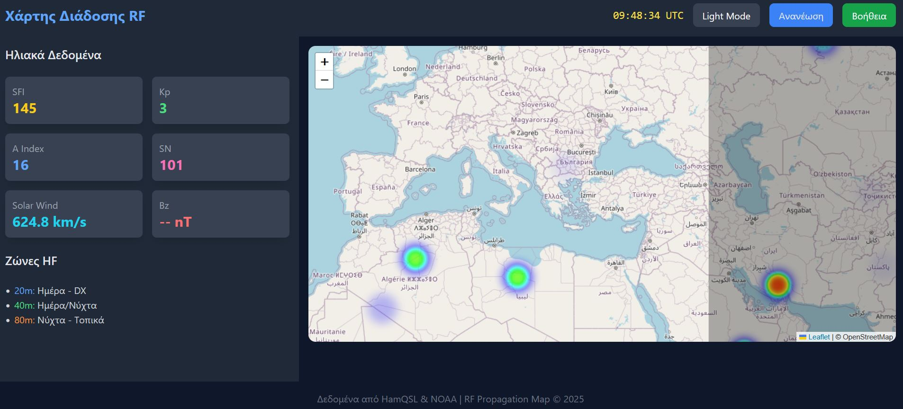

# RF Propagation Map - Προηγμένος Χάρτης Διάδοσης Ραδιοκυμάτων

Αυτό το έργο είναι μια διαδικτυακή εφαρμογή που εμφανίζει έναν χάρτη διάδοσης ραδιοκυμάτων (RF Propagation) βασισμένο σε δεδομένα ηλιακής δραστηριότητας και γεωμαγνητικών δεικτών. Η εφαρμογή περιλαμβάνει:

- **Δυναμικό heatmap** διάδοσης που δείχνει υποθετικές περιοχές διάδοσης RF.
- **UTC ρολόι** για ακριβή χρονισμό.
- **Grayline overlay** που δείχνει τη γραμμή ημέρας/νύχτας στη Γη.
- **Πίνακα ηλιακών δεδομένων** (SFI, Kp Index, A Index, Sunspot Number, Solar Wind, Bz).
- **Ζώνες HF** με βασικές πληροφορίες για χρήση των 20m, 40m, και 80m ζωνών.
- **Lightbox βοήθειας** με επεξηγήσεις των δεδομένων και οδηγίες χρήσης.

---

## Χρήση

- Ανοίξτε το αρχείο `index.html` σε σύγχρονο φυλλομετρητή (Chrome, Firefox, Edge).
- Ο χάρτης εμφανίζει heatmap με τυχαία σημεία (προς επίδειξη).
- Το UTC ρολόι ενημερώνεται κάθε δευτερόλεπτο.
- Η γραμμή ημέρας/νύχτας (grayline) ενημερώνεται κάθε λεπτό.
- Τα ηλιακά δεδομένα ανανεώνονται κάθε 5 λεπτά αυτόματα.
- Πατήστε το κουμπί **Βοήθεια** για να δείτε λεπτομερείς πληροφορίες σχετικά με τα ηλιακά δεδομένα και τις ζώνες HF.
- Το κουμπί **Ανανέωση** ανανεώνει τα ηλιακά δεδομένα και τα σημεία heatmap.

---

## Επεξήγηση Ηλιακών Δεδομένων

- **SFI (Solar Flux Index):** Δείχνει την ηλιακή δραστηριότητα. Τιμές πάνω από 100 σημαίνουν καλύτερη διάδοση στα HF.
- **Kp Index:** Δείχνει τη γεωμαγνητική διαταραχή. Τιμές 0-2 είναι ήσυχες, ενώ τιμές πάνω από 5 σημαίνουν καταιγίδες που επηρεάζουν τη διάδοση.
- **A Index:** Μετρά την αστάθεια του μαγνητικού πεδίου μέσα σε 24 ώρες. Χαμηλές τιμές (0-10) είναι καλές για διάδοση.
- **SN (Sunspot Number):** Ο αριθμός ηλιακών κηλίδων. Υψηλότερες τιμές σημαίνουν αυξημένη ηλιακή δραστηριότητα.
- **Solar Wind:** Ταχύτητα του ηλιακού ανέμου σε km/s. Ταχύτητες πάνω από 500 km/s μπορεί να προκαλέσουν διαταραχές.
- **Bz:** Συνιστώσα του μαγνητικού πεδίου του ηλιακού ανέμου. Αρνητικές τιμές (π.χ. κάτω από -5) μπορεί να προκαλέσουν γεωμαγνητικές καταιγίδες.

---

## Ζώνες HF

- **20m (14 MHz):** Κυρίως ημέρα, καλό για DX (μακρινές επαφές).
- **40m (7 MHz):** Λειτουργεί καλά και μέρα και νύχτα.
- **80m (3.5 MHz):** Καλύτερο τη νύχτα, για τοπικές επαφές.

---

## Τεχνικά

- Χρησιμοποιεί **Leaflet.js** για τον χάρτη και **Leaflet.heat** για το heatmap.
- Τα ηλιακά δεδομένα φορτώνονται μέσω proxy (allorigins.win) για να παρακαμφθεί το CORS.
- Το UI είναι βασισμένο σε **Tailwind CSS**.
- Η γραμμή ημέρας/νύχτας προσεγγίζεται με ένα μαύρο διάφανο ορθογώνιο που κινείται ανάλογα με την ώρα UTC.

---

## Screenshot

---

## Σημείωση

Τα σημεία του heatmap είναι τυχαία και προορίζονται για επίδειξη. Για πραγματική διάδοση RF, απαιτούνται εξειδικευμένα δεδομένα.

---

Αν χρειαστείς βοήθεια ή έχεις απορίες, μη διστάσεις να ρωτήσεις!
